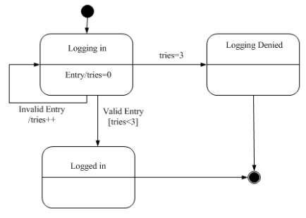

# 真题-q-001234

## 题目

某软件系统限定:用户登录失败的次数不能超过3次。采用如所示的UML状态图对用户登录状态进行建模，假设活动状态是Logging in，那么当Valid Entry发生时，(41)。其中，[tries<3]和tries＋＋分别为(42)和 （请作答此空）。

## 选项

- **A.** 状态

- **B.** 转换

- **C.** 监护条件

- **D.** 转换后效果

## 参考答案

- **B.** 转换
