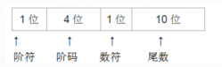

# 真题-q-001252

## 题目

某种机器的浮点数表示格式如下(允许非规格化表示)。若阶码以补码表示，尾数以原码表示，则1 0001 0 0000000001表示的浮点数是(6) 。

## 选项

- **A.** 2^-16 ×2^-10

- **B.** 2^-15 ×2^-10

- **C.** 2^-16×(1-2^-10)

- **D.** 2^-15×(1-2^-10)

## 参考答案

- **B.** 2^-15 ×2^-10
