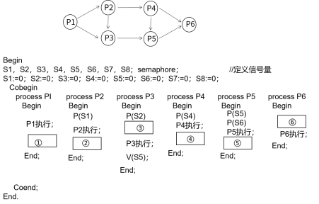

# 真题-q-001315

## 题目

进程 P1、P2、P3、P4、P5 和 P6 的前趋图如下所示。假设用 PV 操作来控制这 6 个进程的同步与互斥，程序中的空①和空②处应分别为（1）；空③和空④处应分别为（2）；空⑤和空⑥处应分别为（请作答此空）。

## 选项

- **A.** `V(S6)` 和 `P(S7)`、`P(S8)`

- **B.** `P(S8)` 和 `P(S7)`、`P(S8)`

- **C.** `P(S8)` 和 `P(S7)`、`V(S8)`

- **D.** `V(S8)` 和 `P(S7)`、`P(S8)`

## 参考答案

- **D.** `V(S8)` 和 `P(S7)`、`P(S8)`
