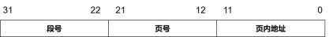

# 真题-q-001316

## 题目

假设段页式存储管理系统中的地址结构如下图所示，则系统（27）。

## 选项

- **A.** 最多可有512个段，每个段的大小均为2048个页，页的大小为8K

- **B.** 最多可有512个段，每个段最大允许有2048个页，页的大小为8K

- **C.** 最多可有1024个段，每个段的大小均为1024个页，页的大小为4K

- **D.** 最多可有1024个段，每个段最大允许有1024个页，页的大小为4K

## 参考答案

- **D.** 最多可有1024个段，每个段最大允许有1024个页，页的大小为4K
