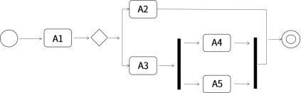

# 真题-q-001330

## 题目

UML活动图用于建模（请作答此空）。以下活动图中，活动A1之后，可能的活动执行序列顺序是（2）

## 选项

- **A.** 系统在它的周边环境的语境中所提供的外部可见服务

- **B.** 某一时刻一组对象以及它们之间的关系

- **C.** 系统内从一个活动到另一个活动的流程

- **D.** 对象的生命周期中某个条件或者状态

## 参考答案

- **C.** 系统内从一个活动到另一个活动的流程
