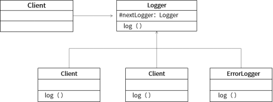

# 真题-q-001335

## 题目

在某系统中，不同级别的日志信息记录方式不同，每个级别的日志处理对象根据信息级别高低，采用不同方式进行记录。每个日志处理对象检查消息的级别，如果达到它的级别则进行记录，否则不记录然后将消息传递给它的下一个日志处理对象。针对此需求，设计如下所示类图。该设计采用（1）模式使多个前后连接的对象都有机会处理请求，从而避免请求的发送者和接收者之间的耦合关系。该模式属于_（2） 模式，该模式适用于（请作答此空）。

## 选项

- **A.** 不同的标准过滤一组对象，并通过逻辑操作以解耦的方式将它们链接起来

- **B.** 可处理一个请求的对象集合应被动态指定

- **C.** 必须保存一个对象在某一个时刻的状态，需要时它才能恢复到先前的状态

- **D.** 一个类定义了多种行为，并且以多个条件语句的形式出现

## 参考答案

- **B.** 可处理一个请求的对象集合应被动态指定
