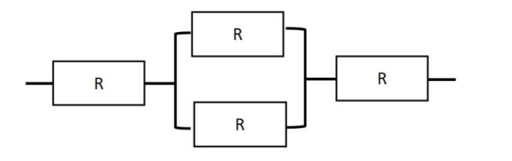

# 真题-q-001364

## 题目

某计算机系统构成如下图所示，假设每个软件的千小时可靠度Ｒ为0.95，则该系统的千小时可靠度约为  ( 5 )  。

## 选项

- **A.** 0.95x（1-(1-0.95)＾2)×0.95

- **B.** 0.95×（1-(1-0.95)＾2×0.95）

- **C.** 0.95×2×（1-0.95)×0.95

- **D.** 0.95^4×（1-0.95)^2

## 参考答案

- **A.** 0.95x（1-(1-0.95)＾2)×0.95
