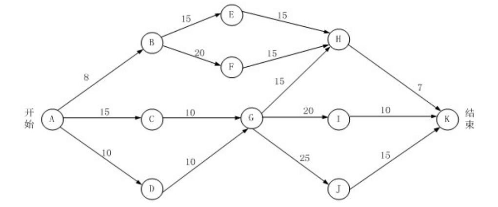

# 真题-q-001377

## 题目

下图是一个软件项目的活动图，其中顶点表示项目里程碑，连接顶点的边表示包含的活动，则里程碑  (  17 )  在关键路径上。若在实际项目进展中，活动AD在活动AC开始3天后才开始，而完成活动DG过程中，由于有临时事件发生，实际需要15天才能完成，则完成该项目的最短时间比原计划多了  （请作答此空）  天。

## 选项

- **A.** 8

- **B.** 3

- **C.** 5

- **D.** 6

## 参考答案

- **B.** 3
