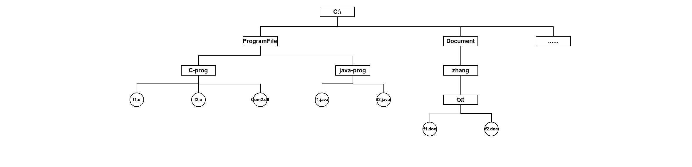

# 真题-q-001384

## 题目

Windows文件系统的目录结构（C盘下）如下图所示，假设用户要访问文件 f2.java，则该文件的全文件名为  (  24 )  。若系统当前工作目录为ProgramFile，那么该文件的相对路径为  （请作答此空）  。

## 选项

- **A.** \java-prog\

- **B.** java-prog\

- **C.** Program\java-prog

- **D.** \Program\java-prog

## 参考答案

- **B.** java-prog\
