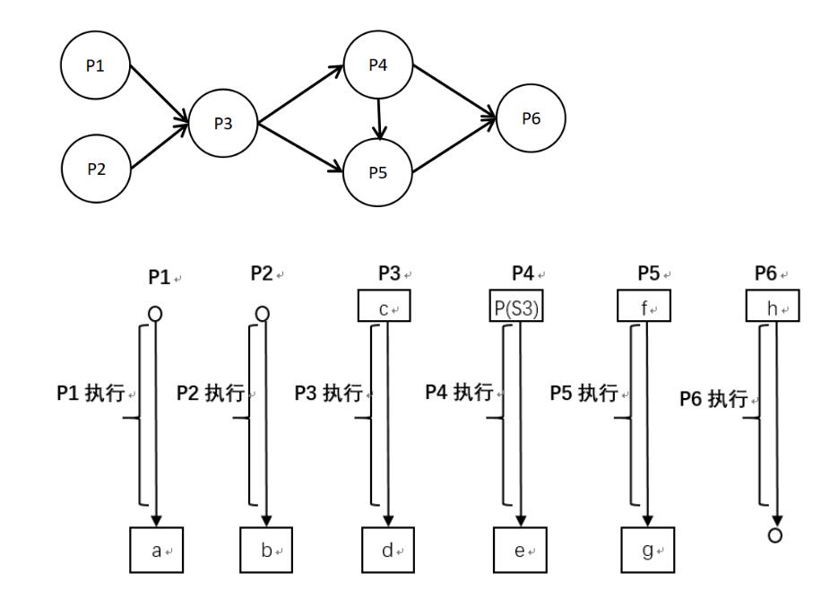

# 真题-q-001385

## 题目

进程P1、P2、 P3、P4、P5和P6的前趋势图如下所示, 若用PV操作控制进程P1、P2、P3、P4、P5和P6并发执行的过程，则需要设置7个信号量 S1、S2、S3、S4、S5、S6和S7，且信号量S1~S7的初值都等于零。P1-P6的进程执行图中，a和b处应分别填写  （请作答此空）  ；c和d处应分别填写  (  27 )  ；e和f处应分别填写  (  28 )  ;g和h处应分别填写  (  29 )

## 选项

- **A.** V(S1)和V(S2)

- **B.** P(S1)和P(S2)

- **C.** P(S1)和V(S2)

- **D.** V(S1)和P(S2)

## 参考答案

- **A.** V(S1)和V(S2)
