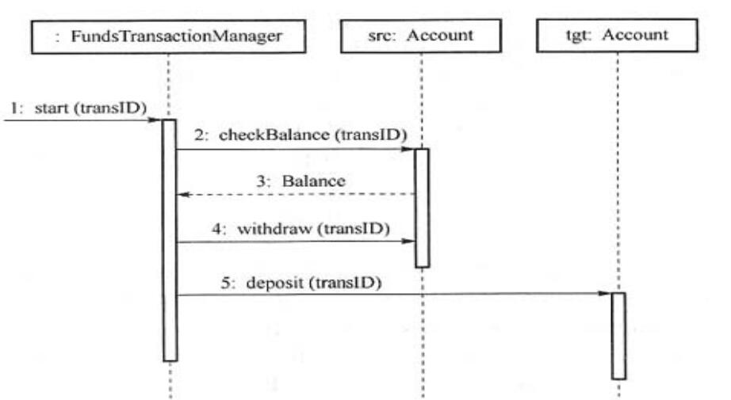

# 真题-q-001401

## 题目

UML序列图是业务场景的图形化表示，描述了以  (  41 ) 顺序组织的对象之间的交互活动。某系统中的一个UML序列图如下图所示，  （请作答此空）表示返回消息，Account类必须实现的方法有  (  43 )。

## 选项

- **A.** transID

- **B.** balance

- **C.** withdraw

- **D.** deposit

## 参考答案

- **B.** balance
