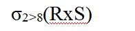
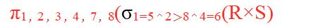
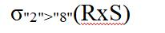
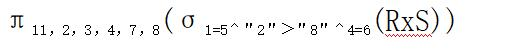

# 真题-q-001412

## 题目

给定关系R（A，B，C，D)和关系S(A，D，E，F)，若对这两个关系进行自然连接运算R⋈S后的属性列有  (  52 )  个；关系代数表达式σR.B>S.F(R ⋈ S)与  （请作答此空）  等价。

## 选项

- **A.** 

- **B.** 

- **C.** 

- **D.** 

## 参考答案

- **B.** 
