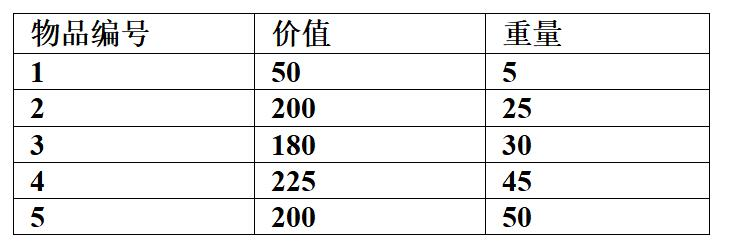

# 真题-q-001413

## 题目

考虑下述背包问题的实例。有5件物品，背包容量为100，每件物品的价值和重量如下所示，并已经按照物品的单位重量价值从大到小排好序。根据物品单位重量价值大优先的策略装入背包中，则采用了  （请作答此空）  设计策略。考虑0/1背包问题(每件物品或者全部装入背包或者不装入背包)和部分背包问题(物品可以部分装入背包)，求解该实例得到的最大价值分别为  (  55 )  。

## 选项

- **A.** 分治

- **B.** 贪心

- **C.** 动态规划

- **D.** 回溯

## 参考答案

- **B.** 贪心
