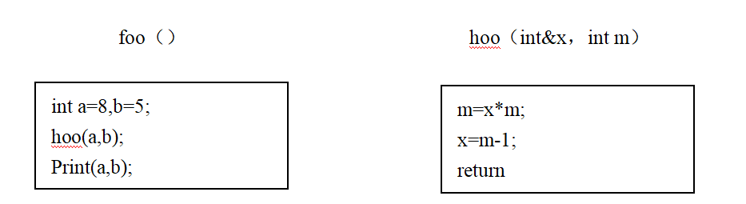

# 真题-q-001451

## 题目

设函数 `foo` 和 `hoo` 的定义如下图所示，在函数 `foo` 中调用函数 `hoo`。`hoo` 的第一个参数采用传引用方式（call by reference），第二个参数采用传值方式（call by value），那么函数 `foo` 中的 `print(a, b)` 将输出（22）。

## 选项

- **A.** 8，5

- **B.** 39，5

- **C.** 8，40

- **D.** 39，40

## 参考答案

- **B.** 39，5
