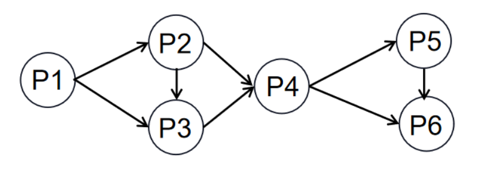
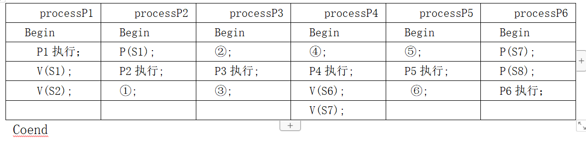

# 真题-q-001457

## 题目

进程P1、P2、 P3、P4、P5和P6的前趋势图如下所示, 若用PV操作控制进程P1、P2、P3、P4、P5和P6并发执行的过程，需要设置8个信号量S1、S2、S3、S4、S5、S6、S7和S8，且信号量 S1~S8 的初值都等于零。下面P1~P6的进程执行过程中，①和②处应分别填写  (  26 )  ；③和④处应分别填写  (  27 )  ；⑤和⑥处应分别填写  （请作答此空）  。

begin
S1,S2,S3,S4,S5,S6,S7,S8:semaphore; //定义信号量
S1:=0;S2:=0;S3:=0;S4:=0;S5:=0; S6:=0;S7:=0;S8=0
Cobegin

## 选项

- **A.** V(S6)和V(S8)

- **B.** P (S6)和P(S7)

- **C.** P(S6) 和V(S8)

- **D.** P(S6)和P(S8)

## 参考答案

- **C.** P(S6) 和V(S8)
