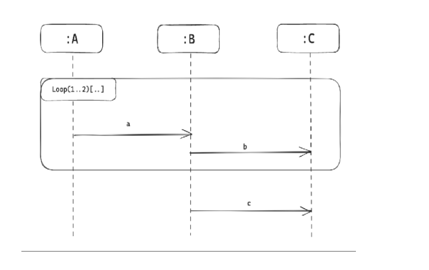

# 真题-q-001470

## 题目

UML，序列图用于建模  （请作答此空） ，如下所示序列图中，可能的消息顺序是 (  42 )。

## 选项

- **A.** 系统在它的周边环境的语境中所提供的外部可见服务

- **B.** 某一时刻一组对象以及它们之间的关系

- **C.** 系统内从一个活动到另一个活动的流程

- **D.** 以时间顺序组织的对象之间的交互活动

## 参考答案

- **D.** 以时间顺序组织的对象之间的交互活动
