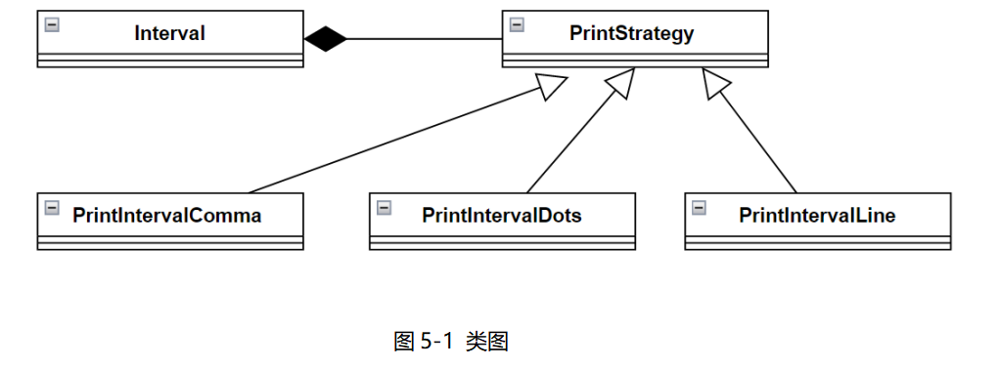

# 真题-q-001500

## 题目

试题五（15 分）
阅读下列说明和 Java 代码，将应填入（n）处的字句写在答题纸的对应栏内。
【说明】
在某系统中，类 Interval 代表由下界（lower bound）和上界（upper bound）定义的区间。要求采用不同的格式显示区间范围，如【lower bound.upper bound】、【lower bound...upper bound】、【lower bound-upper bound】等。现采用策略（Strategy）模式实现该要求，得到如图 5-1 所示的类图。

【Java 代码】
```java
enum TYPE { COMMA, DOTS, LINE }

interface PrintStrategy {
    public （1）;
}
class Interval {
    private double lowerBound;
    private double upperBound;

    public Interval(double pLower, double pUpper) {
        lowerBound = pLower;
        upperBound = pUpper;
    }

    public void printInterval(PrintStrategy ps) {
        （2）;
    }

    public double getLower() {
        return lowerBound;
    }

    public double getUpper() {
        return upperBound;
    }
}
class PrintIntervalLine implements PrintStrategy {
    public void doPrint(Interval val) {
        System.out.println("[" + val.getLower() + "-" + val.getUpper() + "]");
    }
}
class PrintIntervalDots implements PrintStrategy {
    public void doPrint(Interval val) {
        System.out.println("[" + val.getLower() + "..." + val.getUpper() + "]");
    }
}
class PrintIntervalComma implements PrintStrategy {
    public void doPrint(Interval val) {
        System.out.println("[" + val.getLower() + "," + val.getUpper() + "]");
    }
}
public class Client {
    public static PrintStrategy getStrategy(TYPE type) {
        PrintStrategy st = null;
        switch (type) {
            case COMMA:
                （3）;
                break;
            case DOTS:
                （4）;
                break;
            case LINE:
                （5）;
                break;
        }
        return st;
    }

    public static void main(String[] args) {
        Interval interval = new Interval(1.7, 2.1);
        interval.printInterval(getStrategy(TYPE.COMMA));
        interval.printInterval(getStrategy(TYPE.DOTS));
        interval.printInterval(getStrategy(TYPE.LINE));
    }
}
```


