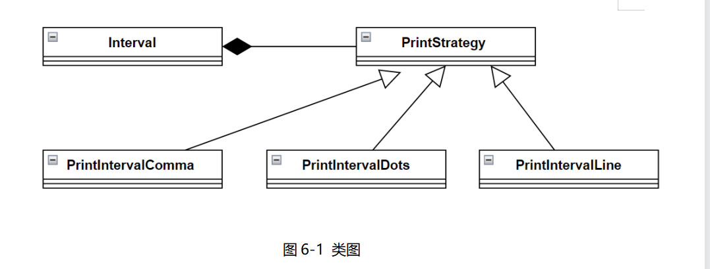

# 真题-q-001501

## 题目

试题六（15 分）
阅读下列说明和 C++ 代码。将应填入（n）处的字句写在答题纸的对应栏内。
【说明】
在某系统中，类 Interval 代表由下界（lower bound）和上界（upper bound）定义的区间。要求采用不同的格式显示区间范围，如【lower bound.upper bound】、【lower bound...upper bound】、【lower bound-upper bound】等。现采用策略（Strategy）模式实现该要求，得到如图 6-1 所示的类图。

【C++ 代码】
```cpp
#include <iostream>
using namespace std;

class Interval;

class PrintStrategy {
public:
    （1）;
};

class Interval {
private:
    double lowerBound;
    double upperBound;
public:
    Interval(double pLower, double pUpper) {
        lowerBound = pLower;
        upperBound = pUpper;
    }

    void printInterval(PrintStrategy* prt) {
        （2）;
    }

    double getLower() { return lowerBound; }
    double getUpper() { return upperBound; }
};

class PrintIntervalComma : public PrintStrategy {
public:
    void doPrint(Interval* val) {
        cout << "[" << val->getLower() << "," << val->getUpper() << "]" << endl;
    }
};

class PrintIntervalDots : public PrintStrategy {
public:
    void doPrint(Interval* val) {
        cout << "[" << val->getLower() << "..." << val->getUpper() << "]" << endl;
    }
};

class PrintIntervalLine : public PrintStrategy {
public:
    void doPrint(Interval* val) {
        cout << "[" << val->getLower() << "-" << val->getUpper() << "]" << endl;
    }
};

enum TYPE { COMMA, DOTS, LINE };

PrintStrategy* getStrategy(TYPE type) {
    PrintStrategy* st = nullptr;
    switch (type) {
    case COMMA:
        （3）;
        break;
    case DOTS:
        （4）;
        break;
    case LINE:
        （5）;
        break;
    }
    return st;
}

int main() {
    Interval a(1.7, 2.1);
    a.printInterval(getStrategy(COMMA));
    a.printInterval(getStrategy(DOTS));
    a.printInterval(getStrategy(LINE));
    return 0;
}
```


