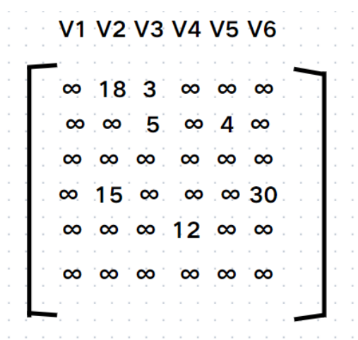

# 真题-q-001597

## 题目

对下列有向图的邻接矩阵，进行深度遍历的次序是( )

## 选项

- **A.** v1-v2-v3-v4-v5-v6

- **B.** v1-v4-v2-v3-v5-v6

- **C.** v1-v2-v3-v5-v4-v6

- **D.** v1-v2-v5-v4-v3-v6

## 参考答案

- **C.** v1-v2-v3-v5-v4-v6
