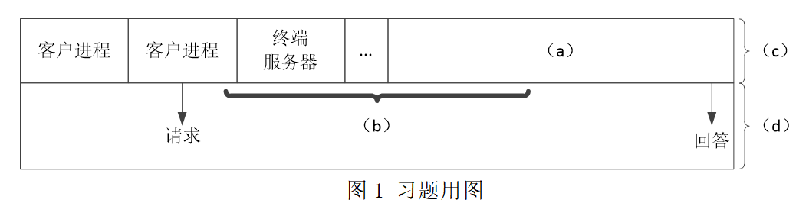

# 真题-q-001624

## 题目

采用微内核结构的操作系统设计的基本思想是内核只完成操作系统最基本的功能并在核心态下运行，其他功能运行在用户态，其结构图如图1所示。图中空（a）、（b）、（c）和（d）应分别选择如下所示①~④中的哪一项? （1） 。
①文件和存储器服务器 ②进程调度及进程间通信 ③核心态 ④用户态

## 选项

- **A.** ①、②、④和③

- **B.** ④、③、②和①

- **C.** ③、④、②和①

- **D.** ③、①、④和②

## 参考答案

- **A.** ①、②、④和③
