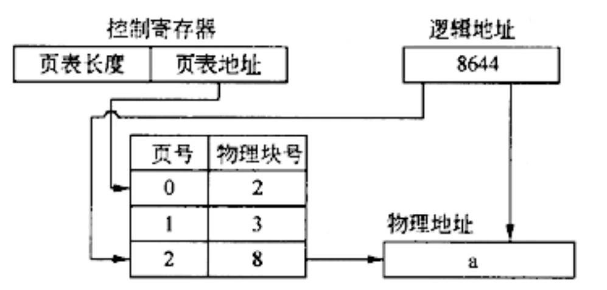

# 真题-q-001627

## 题目

页式存储系统的逻辑地址是由页号和页内地址两部分组成。假定页面的大小为4K，地址变换过程如下图所示，图中逻辑地址用十进制表示。

图中有效地址经过变换后，十进制物理地址a应为（ ）。

## 选项

- **A.** 33220

- **B.** 8644

- **C.** 4548

- **D.** 2500

## 参考答案

- **A.** 33220
