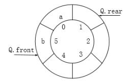

# 真题-q-001658

## 题目

某循环队列Q的定义中用front和rear两个整型域变量表示队列状态，其中front指示队头元素的位置．rear指示队尾元素之后的位置（如下图所示，front的值为5、rear的值为1）。若队列容量为M（下图中M=6），则计算队列长度的通式为 （） 。

## 选项

- **A.** (Q.front - Q.rear)

- **B.** (Q.front - Q.rear + M)%M

- **C.** (Q.rear - Q.front)

- **D.** (Q.rear - Q.front + M)%M

## 参考答案

- **D.** (Q.rear - Q.front + M)%M
