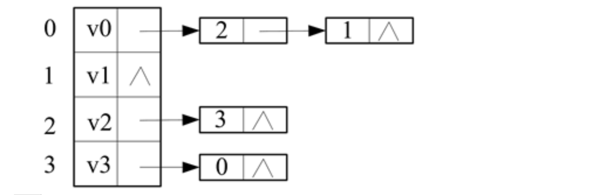

# 真题-q-001663

## 题目

某有向图G的邻接表如下图所示，可看出该图中存在弧<v2，v3>，而不存在从顶点Vi出发的弧。关于图G的叙述中，错误的是 （ ） 。

## 选项

- **A.** G中存在回路

- **B.** G中每个顶点的入度都为1

- **C.** G的邻接矩阵是对称的

- **D.** G中不存在弧<v3，v1>

## 参考答案

- **C.** G的邻接矩阵是对称的
