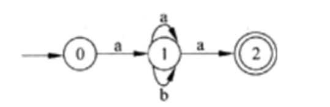

# 真题-q-001698

## 题目

下图是一有限自动机的状态转换图，该自动机所识别语言的特点是（请作答此空），等价的正规式为（26）。

## 选项

- **A.** 由符号a、b构成且包含偶数个a的串

- **B.** 由符号a、b构成且开头和结尾符号都为a的串

- **C.** 由符号a、b构成的任意串

- **D.** 由符号a、b构成且b的前后必须为a的串

## 参考答案

- **B.** 由符号a、b构成且开头和结尾符号都为a的串
