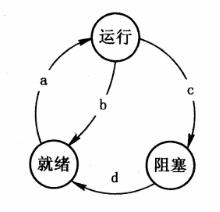

# 真题-q-001764

## 题目

假设某计算机系统中进程的三态模型如下图所示，那么图中的a、 b、c、d处应分别填写（ ）。

## 选项

- **A.** 作业调度、时间片到、等待某事件、等待某事件发生了

- **B.** 进程调度、时间片到、等待某事件、等待某事件发生了

- **C.** 作业调度、等待某事件、等待某事件发生了、时间片到

- **D.** 进程调度、等待某事件、等待某事件发生了、时间片到

## 参考答案

- **B.** 进程调度、时间片到、等待某事件、等待某事件发生了
