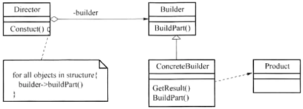

# 真题-q-001786

## 题目

下图所示为 （请作答此空） 设计模式，适用于 （2） 。

## 选项

- **A.** 抽象工厂(Abstract Factory)

- **B.** 生成器(Builder)

- **C.** 工厂方法(Factory Method)

- **D.** 原型(Prototype)

## 参考答案

- **B.** 生成器(Builder)
