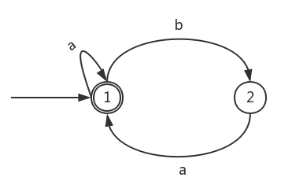

# 真题-q-001788

## 题目

以下关于下图所示有限自动机的叙述中，不正确的是 （ ） 。

## 选项

- **A.** 该自动机识别的字符串中a不能连续出现

- **B.** 自动机识别的字符串中b不能连续出现

- **C.** 自动机识别的非空字符串必须以a结尾

- **D.** 自动机识别的字符串可以为空串

## 参考答案

- **A.** 该自动机识别的字符串中a不能连续出现
