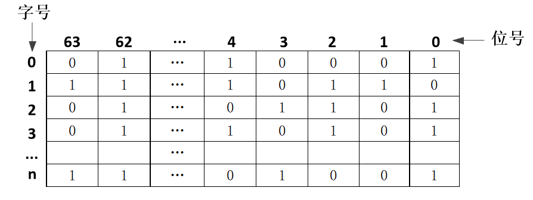

# 真题-q-001888

## 题目

某文件管理系统在磁盘上建立了位示图（bitmap），记录磁盘的使用情况。若磁盘上物理块的编号依次为0、1、2、……，系统中的字长为64位，字的编号依次为0、1、2、……。字中的一位对应文件存储器上的一个物理块。取值0和1分别表示空闲和占用。如下图所示。

假设操作系统将387号物理块分配给某文件，那么该物理块的使用情况在位示图中编号为 （请作答此空） 的字中描述，系统应该将 （2） 。

## 选项

- **A.** 3

- **B.** 4

- **C.** 5

- **D.** 6

## 参考答案

- **D.** 6
