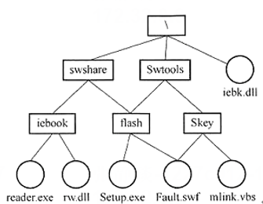

# 真题-q-002016

## 题目

若某文件系统的目录结构如下图所示，假设用户要访问文件fault.swf，且当前工作目录为swshare，则该文件的全文件名为 （请作答此空） ，相对路径和绝对路径分别为 （ ） 。

## 选项

- **A.** `fault.swf`

- **B.** `flash\fault.swf`

- **C.** `swshare\flash\fault.swf`

- **D.** `\swshare\flash\fault.swf`

## 参考答案

- **D.** `\swshare\flash\fault.swf`
