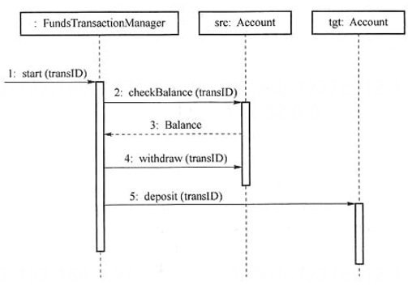

# 真题-q-002032

## 题目

如下所示的UML序列图中， （ ） 表示返回消息，Account类必须实现的方法有（请作答此空） 。

## 选项

- **A.** start0

- **B.** checkBalance()和withdraw()

- **C.** deposit0

- **D.** checkBalance()、withdraw()和deposit()

## 参考答案

- **D.** checkBalance()、withdraw()和deposit()
