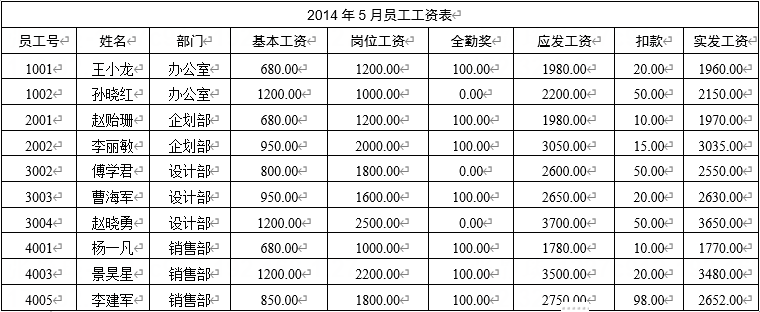

# 真题-q-002045

## 题目

假定某企业2014年5月的员工工资如下表所示：

查询人数大于2的部门和部门员工应发工资的平均工资的SQL语句如下：
SELECT （ ）
FROM工资表
（ ）
（请作答此空）；

## 选项

- **A.** WHERE COUNT(姓名)>2

- **B.** WHERE COUNT(DISTINCT(部门))>2

- **C.** HAVING COUNT(姓名)>2

- **D.** HAVING COUNT(DISTINCT(部门))>2

## 参考答案

- **C.** HAVING COUNT(姓名)>2
