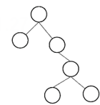

# 真题-q-002048

## 题目

某二叉树如图所示，若进行顺序存储（即用一维数组元素存储该二叉树中的节点且通过下标反映节点间的关系，例如，对于下标为i的节点，其左孩子的下标为2i、右孩子的下标为2i+1），则该数组的大小至少为 （ ） ；若采用三叉链表存储该二叉树（各个节点包括节点的数据、父节点指针、左孩子指针、右孩子指针），则该链表的所有节点中空指针的数目为 （请作答此空） 。

## 选项

- **A.** 6

- **B.** 8

- **C.** 12

- **D.** 14

## 参考答案

- **B.** 8
