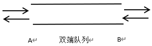

# 真题-q-002049

## 题目

某双端队列如下图所示，要求元素进出队列必须在同一端口，即从A端进入的元素必须从A端出、从B端进入的元素必须从B端出，则对于4个元素的序列e1、e2、e3、e4，若要求前2个元素（e1、e2）从A端口按次序全部进入队列，后两个元素（e3、e4）从B端口按次序全部进入队列，则可能得到的出队序列是 （ ） 。

## 选项

- **A.** e1、e2、e3、e4

- **B.** e2、e3、e4、e1

- **C.** e3、e4、e1、e2

- **D.** e4、e3、e2、e1

## 参考答案

- **D.** e4、e3、e2、e1
