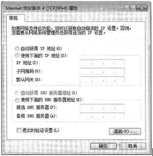

# 真题-q-002057

## 题目

校园网连接运营商的IP地址为202.117.113.3/30，本地网关的地址为192.168.1.254/24，如果本地计算机采用动态地址分配，在下图中应该如何配置 （ ） 。

## 选项

- **A.** 选取“自动获得IP地址”

- **B.** 配置本地计算机IP地址为192.168.1.×

- **C.** 配置本地计算机1P地址为202.115.113.×

- **D.** 在网络169.254.×.×中选取一个不冲突的IP地址

## 参考答案

- **A.** 选取“自动获得IP地址”
