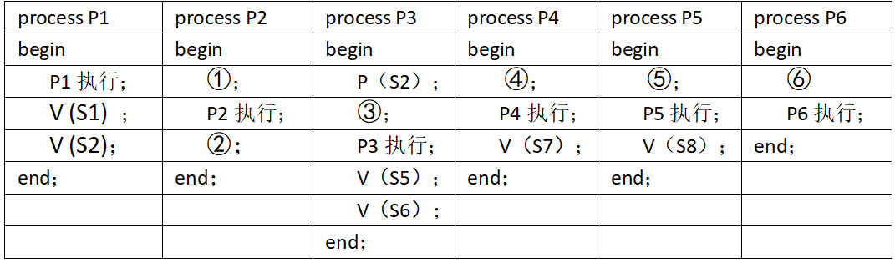

# 真题-q-002063

## 题目

进程P1、P2、P3、P4、P5和P6的前趋图如下图所示：

若用PV操作控制这6个进程的同步与互斥的程序如下，那么程序中的空①和空②处应分别为 （1） ；空③和空④处应分别为 （2） ；空⑤和空⑥处应分别为 （请作答此空） 。

begin
  S1，S2，S3，S4，S5，S6，S7，S8：semaphore；   //定义信号量
  S1:=0；S2：=0；S3:=0；S4=0；S5:=0；S6:=0；S7:=0；S8:=0；
  Cobegin

 Coend；
end

## 选项

- **A.** P (S6)和P (S7) V (S8）

- **B.** V (S6)和V (S7) V (S8)

- **C.** P (S6)和P (S7) P (S8）

- **D.** V (S7)和P (S7) P (S8)

## 参考答案

- **C.** P (S6)和P (S7) P (S8）
