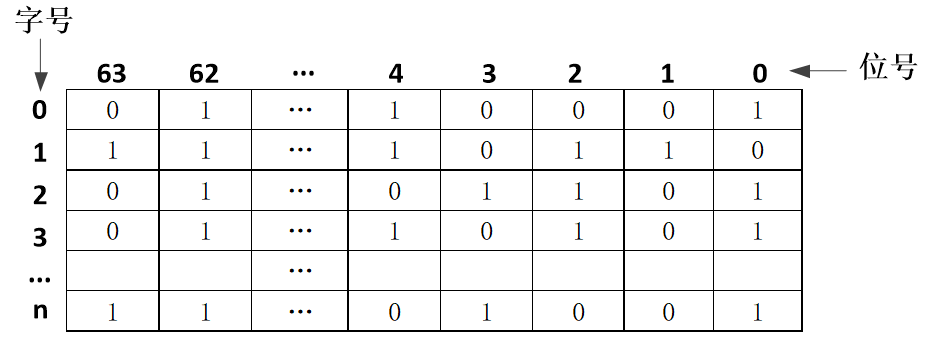

# 真题-q-002065

## 题目

某文件管理系统在磁盘上建立了位示图（bitmap），记录磁盘的使用情况。若磁盘上物理块的编号依次为 0、1、2、…，系统中的字长为 64 位，字的编号依次为 0、1、2、…，字中的一位对应文件存储器上的一个物理块，取值 0 和 1 分别表示空闲和占用，如下图所示。

假设操作系统将387号物理块分配给某文件，那么该物理块的使用情况在位示图中编号为 （1） 的字中描述，系统应该将 （请作答此空） 。

## 选项

- **A.** 该字的0号位置“1”

- **B.** 该字的1号位置“1”

- **C.** 该字的2号位置“1”

- **D.** 该字的3号位置“1”

## 参考答案

- **D.** 该字的3号位置“1”
