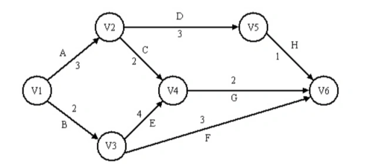

# 真题-q-002112

## 题目

下图是一个软件项目的活动图，其中顶点表示项目里程碑，连接顶点的边表示包含的活动。边上的权重表示活动的持续时间（天），则完成该项目最少时间（1）天。在其他活动都按时完成的情况下，活动C最多可以晚（请作答此空）天可以不影响工期。

## 选项

- **A.** 0

- **B.** 1

- **C.** 2

- **D.** 3

## 参考答案

- **B.** 1
