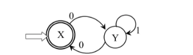

# 真题-q-002148

## 题目

状态转换图如下图所示，其可以接受的字符集为（ ）。

## 选项

- **A.** 以0开头的二进制数组成的集合

- **B.** 以0结尾的二进制数组成的集合

- **C.** 含奇数个0的二进制数组成的集合

- **D.** 以0开头和结尾且0的个数为偶数的二进制数组成的集合

## 参考答案

- **D.** 以0开头和结尾且0的个数为偶数的二进制数组成的集合
