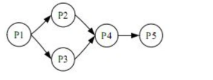
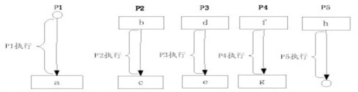

# 真题-q-002150

## 题目

进程P1、P2、P3、P4、P5的前趋图如下：

● 若用PV操作控制进程并发执行的过程，则需要相应于进程执行过程设置5个信号量S1、S2、S3、S4和S5，且信号量初值都等于零。下图中a处应填写（请作答此空） ；b和c、d和e处应分别填写（2） ，f、g和h应分别填写（3） 。

## 选项

- **A.** P（S1）和P（S2）

- **B.** V（S1）和V（S2）

- **C.** P（S1）和V（S2）

- **D.** P（S2）和V（S1）

## 参考答案

- **B.** V（S1）和V（S2）
