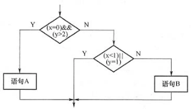

# 真题-q-002164

## 题目

采用白盒测试方法对下图进行测试，设计了4个测试用例：①(x=0，y=3)，②(x=1，y=2)，③(x=-1，y=2)，④(x=3，y=1)。至少需要测试用例①②才能完成（请作答此空）覆盖，至少需要测试用例①②③或①②④才能完成（2）覆盖。

## 选项

- **A.** 语句

- **B.** 条件

- **C.** 判定/条件

- **D.** 路径

## 参考答案

- **A.** 语句
