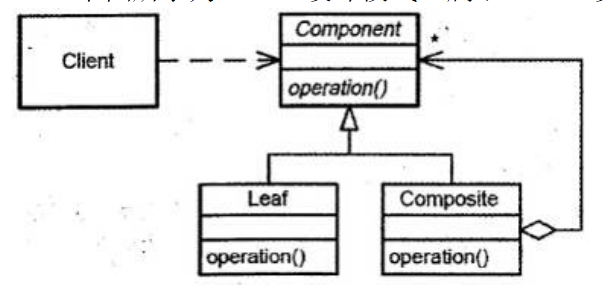

# 真题-q-002171

## 题目

下图所示为（1）设计模式，属于（2）设计模式，适用于（请作答此空）。

## 选项

- **A.** 表示对象的部分—整体层次结构时

- **B.** 当一个对象必须通知其它对象，而它又不能假定其它对象是谁时

- **C.** 当创建复杂对象的算法应该独立于该对象的组成部分及其装配方式时

- **D.** 在需要比较通用和复杂的对象指针代替简单的指针时

## 参考答案

- **A.** 表示对象的部分—整体层次结构时
