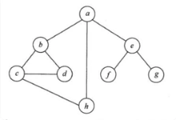

# 真题-q-002190

## 题目

对如下无向图进行遍历，则下列选项中，不是广度优先遍历序列的是（ ）。

## 选项

- **A.** h,c,a,b,d,e,g,f

- **B.** e,a,f,g,b,h,c,d

- **C.** d,b,c,a,h,e,f,g

- **D.** a,b,c,d,h,e,f,g

## 参考答案

- **D.** a,b,c,d,h,e,f,g
