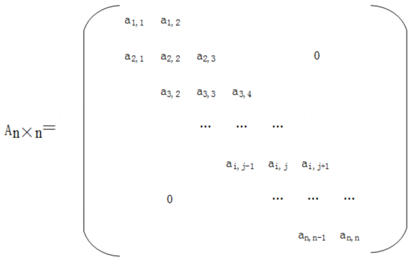

# 真题-q-002291

## 题目

某n阶的三对角矩阵A如下图所示，按行将元素存储在一堆数组M中，设a1,1存储在M[1]，那么ai，j(1<=i，j<=n且ai，j位于三条对角线中），存储在M（ ）。

## 选项

- **A.** i+2j

- **B.** 2i+j

- **C.** i+2j-2

- **D.** 2i+j-2

## 参考答案

- **D.** 2i+j-2
