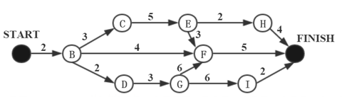

# 真题-q-002314

## 题目

某软件项目的活动图如下图所示，其中顶点表示项目里程碑，链接顶点的边表示包含的活动，边上数字表示活动的持续时间（天）。完成该项目的最少时间为（ ）天。由于某种原因，现在需要同一个开发人员完成BC和BD，则完成该项目的最少时间为（本题）天。

## 选项

- **A.** 11

- **B.** 18

- **C.** 20

- **D.** 21

## 参考答案

- **C.** 20
