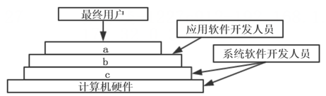

# 真题-q-002319

## 题目

计算机系统的层次结构如下图所示，基于硬件之上的软件可分为a、b和c三个层次。图中a、b和c分别表示（ ）。

## 选项

- **A.** 操作系统、系统软件和应用软件

- **B.** 操作系统、应用软件和系统软件

- **C.** 应用软件、系统软件和操作系统

- **D.** 应用软件、操作系统和系统软件

## 参考答案

- **C.** 应用软件、系统软件和操作系统
