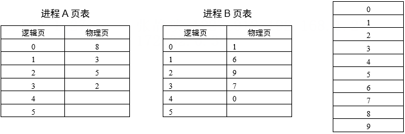

# 真题-q-002324

## 题目

某操作系统采用分页存储管理方式，下图给出了进程A和进程B的页表结构。如果物理页的大小为lK字节，那么进程A中逻辑地址为1024（十进制）的变量存放在（ ）号物理内存页中。假设进程A的逻辑页4与进程B的逻辑页5要共享物理页4，那么应该在进程A页表的逻辑页4和进程B页表的逻辑页5的物理页处分别填（本题）。

## 选项

- **A.** 4、4

- **B.** 4、5

- **C.** 5、4

- **D.** 5/5

## 参考答案

- **A.** 4、4
