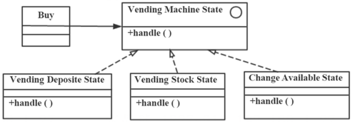

# 真题-q-002342

## 题目

自动售货机根据库存、存放货币量、找零能力、所选项目等不同，在货币存入并进行选择时具有如下行为：交付产品不找零 ：交付产品找零：存入货币不足而不提供任何产品；库存不足而不提供任何产品。这一业务需求适合采用（ ）模式设计实现，其类图如下图所示，其中（ ）是客户程序使用的主要接口，可用状态来对其进行配置。此模式为（本题），体现的最主要的意图是（ ）。

## 选项

- **A.** 创建型对象模式

- **B.** 结构型对象模式

- **C.** 行为型类模式

- **D.** 行为型对象模式

## 参考答案

- **D.** 行为型对象模式
