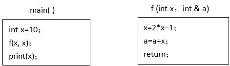

# 真题-q-002346

## 题目

函数 main()、f()的定义如下所示。调用函数 f()时，第一个参数采用传值 (call by value)方式，第二个参数采用传引用（call by reference）方式，则函数 main()执行后输出的值为（ ）。

## 选项

- **A.** 10

- **B.** 19

- **C.** 20

- **D.** 29

## 参考答案

- **D.** 29
