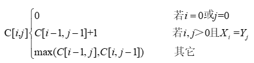

# 真题-q-002358

## 题目

求解两个长度为n的序列X和Y的一个最长公共序列（如序列ABCBDAB和BDCABA的一个最长公共子序列为BCBA）可以采用多种计算方法。如可以采用蛮力法，对X的每一个子序列，判断其是否也是Y的子序列，最后求出最长的即可，该方法的时间复杂度为（本题）。经分析发现该问题具有最优子序列，可以定义序列长度分别为i和j的两个序列X和Y的最长公共子序列的长度为C[i,j]，如下式所示。该方法的时间复杂度为（ ）。

## 选项

- **A.** O(n²)

- **B.** O(n²lgn)

- **C.** O(n³)

- **D.** O(n2ⁿ)

## 参考答案

- **D.** O(n2ⁿ)
