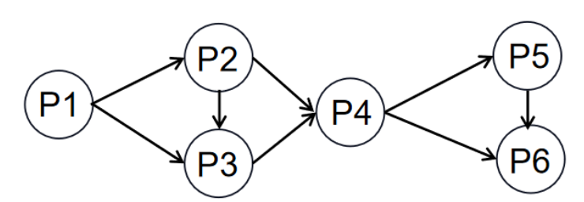
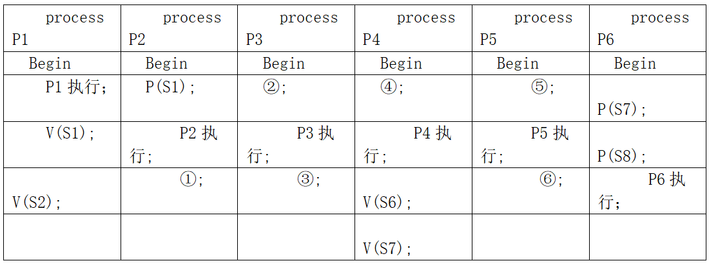

# 真题-q-002413

## 题目

进程P1、P2、 P3、P4、P5和P6的前趋势图如下所示, 若用PV操作控制进程P1、P2、P3、P4、P5和P6并发执行的过程，需要设置8个信号量S1、S2、S3、S4、S5、S6、S7和S8，且信号量?S1~S8?的初值都等于零。下面P1~P6的进程执行过程中，①和②处应分别填写  (   )  ；③和④处应分别填写  （请作答此空）  ；⑤和⑥处应分别填写  (   )  。

begin
S1,S2,S3,S4,S5,S6,S7,S8:semaphore; //定义信号量
S1:=0;S2:=0;S3:=0;S4:=0;S5:=0; S6:=0;S7:=0;S8=0
Cobegin

Coend

## 选项

- **A.** V(S5)和P(S4)P(S5)

- **B.** V(S3)和P(S4)V(S5)

- **C.** P(S5)和V(S4)V(S5)

- **D.** P(S3)和P(S4)P(S5)

## 参考答案

- **A.** V(S5)和P(S4)P(S5)
